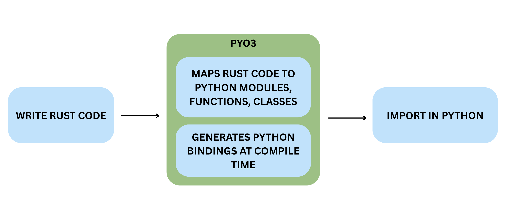
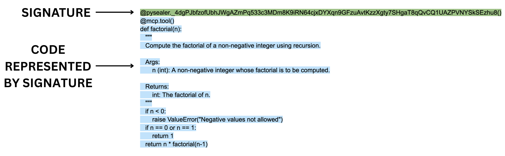

# Method of Approach

## System Architecture

Pysealer implements a cryptographic code integrity verification system through a "sealing" and "unsealing" model for defense-in-depth security. The sealing process involves automatically injecting cryptographic signatures as Python decorators onto functions or classes. Unsealing refers to the verification of these signatures. This process is used to secure source code against unauthorized modifications by ensuring that any changes to the code will invalidate the signature. This defense-in-depth approach effectively creates multiple layers of security that threat actors would have to bypass. From a technical standpoint, Pysealer operates as a hybrid Python-Rust application. The Python layer manages most of the application logic including the command-line interface (CLI), source code manipulation, git integration, GitHub secrets integration, dummy decorator generation, and basic environment variable handling. The Rust layer is responsible for the performance-critical cryptographic operations including generate keypair, generate signature, verify signature functions.

### Pysealer Design

The main Pysealer application was designed to be a command line interface (CLI) tool to allow for as much flexbility and ease of use as possible. Because this tool was built as a CLI, it can be used in a variety of different contexts including local development environments, continuos integration environments, and even cloud-based environments. This design choice allows Pysealer to be easily integrated into existing development workflows and automated processes. By making the Pysealer tool a CLI, it also makes it flexibile for a variety of security and defense-in-depth use cases. For example, developers can choose to run the Pysealer lock command as a pre-commit hook to ensure that code is always signed before any changes are committed to a git repository. Developers can also choose to run the pysealer check command as part of a continuous integration pipeline to automatically verify code integrity on certain actions.

One of the primary considerations when designing Pysealer was to ensure that it could be as platform independent as possible. This means that Pysealer can be used on several versions of the Linux, Mac, and Windows operating systems. It also means that Pysealer's base functionality does not rely on any external tools or services that developers may not want to utilize. For example, developers can optionally choose to integrate Pysealer with GitHub by using their GitHub personal access token (PAT) to enable remote code integrity checks via GitHub Actions. However, this is not a requirement to use Pysealer, and developers can choose to use it solely as a local tool if they prefer. Additionally, because Git is widely used and recommended as a standard practice in the software development community, Pysealer relies on Git to provide detailed diff information when a check fails. If Git is not installed, Pysealer will simply omit this information. By leveraging Git, Pysealer can seamlessly integrate into existing development workflows that already utilize Git for source code management.

Another important design consideration for Pysealer was the choice of programming languages used to build the application. Pysealer was built as a hybrid application using both Python and Rust. The decision to use both languages was driven by the need to balance performance and ease of use. Python was chosen as the primary language for the CLI due to its widespread adoption in the agentic AI systems space. According to a 2024 industry survey, Python has become the dominant language for AI and machine learning projects, with developers citing its extensive ecosystem of libraries, ease of integration, and strong community support [@python-ai-development]. This makes Pysealer particularly well-suited for integration into existing AI development workflows where Python is already the primary language.

### Decorator Implementation

Decorators are the primary mechanism through which Pysealer implements code integrity verification. In Python, decorators are a syntactic feature that allows programmers to modify or enhance the behavior of functions and classes without altering their source code. A decorator is simply a callable (typically a function) that takes another function or class as input and returns a modified version [@python-decorator]. Syntactically, decorators are denoted by the @ symbol placed directly above a function or class definition. For example, `@decorator_name` in Python applies the decorator to the subsequent code block. When the Python interpreter encounters a decorated function, it basically runs `decorator_name(func)`, where func is the original function being decorated. Another important thing to note is that decorators can be stacked, meaning multiple decorators can be applied to a single function or class by placing them on consecutive lines above the definition.

Pysealer utilizes decorators for the sole purpose of attaching cryptographic signatures to functions and classes. During the locking process, Pysealer generates a unique signature for each targeted code block and injects it as a decorator in the form `@pysealer._<signature>()`. Its important to note that this decorator does not modify the function's original behavior; instead, it serves as a cryptographic marker. The decorator that gets added to the code does not contain any logic and is effectively blank. It is purely being used as a marker and servers no functional purpose other than to carry the signature. Additionally, the reason the decorator is named with a leading underscore is because digits cannot be used as the first character in a Python function. Using an underscore also helps indicate that it is intended for internal use within the Pysealer system and not for direct invocation by developers.

To demonstrate the lifecycle of a decorator in Pysealer, consider the following example that illustrates a simple greet function. This example shows four distinct stages: the original code, the locked code with an embedded cryptographic signature, a modification to the function's code, and finally the newly locked code with a new signature reflecting the changes. By observing how the decorator's signature value changes when the underlying code is modified, we can see how Pysealer effectively checks if code has been altered.

```python
# Original Code
def greet(name):
    return f"Hello, {name}!"

# Locked Code
@pysealer._4QBckp1rzZNoTUmfTC9xgKZmqJtv3dm8xr6kXy5TiDhWvWNmVrh8jqZuNMfUQQJAiGPW4W8nDzSYx5M2vQoXG8kG()
def greet(name):
    return f"Hello, {name}!"

# Modified Original Code
def greet(name):
    return f"Hola, {name}!"

# New Locked Code
@pysealer._4crysJGYfjvDMDeaXgtjhs9u7Dvrw6hvCin5AE7jsdnFjqHh3KAW3LNgTwBP7QJCJbGMZF5hLdouMKuxGN91PJ35()
def greet(name):
    return f"Hola, {name}!"
```
\begin{figure}[h!]
\centering
\caption{Pysealer Decorator Example}
\label{fig:pysealer-decorator-example}
\end{figure}

During the checking process, Pysealer scans the source code for these decorators, extracts the embedded signatures stored in them, and verifies them against the current state of the code. The verification process involves generating a new signature based on the current state of the code. Once this signature is generated, it is compared against the signature extracted from the decorator. If the signatures match, it indicates that the code has not been altered since it was locked. If they do not match, it suggests that the code may have been tampered with. If the code has been altered since the locking process, the system reports detailed information about which specific functions or classes have invalid signatures.

Pysealer explores the unique approach of repurposing decorators as carriers for cryptographic signatures rather than their traditional role of modifying function behavior. This approach leverages decorators for several strategic reasons: they are non-invasive, attaching metadata without modifying internal function behavior; they are recognizable, serving as a syntactically valid and consistent way to grab signatures; and they eliminate the need for external metadata storage, where the decorator name itself contains the cryptographic signature. Additionally, many Agentic AI systems, like Model Context Protocol (MCP), rely on decorators to define Python functions as tools. This makes decorators also a familiar construct that can be used to secure these newly created tools. While decorators original purpose is not for signature storage, Pysealer effectively repurposes them to embed cryptographic signatures directly within the source code.

## Technical Implementation

### Maturin Build System

The Pysealer project utilizes Maturin as its build system to seamlessly integrate Rust and Python components. Maturin primarily serves as a bridge between the Rust and Python ecosystems by handling the complex compilation and packaging processes required to produce Python wheels (the standard Python package format) from Rust source code [@maturin]. Maturin is specifically optimized for projects that use PyO3, a Rust library that provides bidirectional bindings between Rust and Python [@py03]. Language bindings are essentially a way to call Rust code in Python and vise versa. More specifically, PyO3 compiles Rust code into a shared library (`.so` on Linux/macOS, `.pyd` on Windows) so that the Python interpreter can load the code as a native extension module. And when a Python program imports this module, it can directly invoke Rust functions as if they were regular Python functions.

By looking at Figure 5, the high level process of transforming a Rust function into a Python callable is shown. First, a developer writes Rust code and annotates functions with PyO3 macros to indicate which functions should be exposed to Python. Next, PyO3 generates the necessary bindings code that acts as a bridge between Rust and Python. After these bindings are generated, PyO3 compiles the Rust code along with the bindings into a shared library. Finally, when the Python interpreter imports the compiled module, it can directly call the Rust functions as if they were native Python functions.



The decision to use Maturin and PyO3 for Pysealer was driven by several factors. First and foremost, Rust is known to have extremely strong and reliable cryptographic libraries that are both secure and performant. Specifically, the Ed25519 signature algorithm used by Pysealer is implemented in the widely adopted Rust cryptography crates from RustCrypto compared to the available Python implementations [@rustcrypto-signatures]. Additionally, recent benchmarking research demonstrates that Rust implementations accessed through PyO3 bindings achieve great performance. In fact, the research found that PyO3 bindings achieve function call overhead of only 0.14 milliseconds, representing a 25-fold improvement over NumPy's 3.56 milliseconds [@rust-c-python-library-2025]. These performance advantages are particularly critical for cryptographic operations that can be computationally intensive, especially when processing signatures at scale. Because of the strong evidence of Rust's cryptographic libraries and the demonstrated performance benefits of using PyO3 bindings, Maturin was the natural choice to facilitate the integration of Rust's capabilities into the Python-based Pysealer application. 

While Rust provides excellent cryptographic capabilities, the decision to build Pysealer's core application logic in Python was more easily justified. Python is widely adopted and used in the agentic AI systems space, making it an ideal choice for a tool intended to integrate seamlessly into existing AI development workflows. Additionally, Python's built-in `ast` module provides native capabilities for parsing Python source code into abstract syntax trees, which is essential for Pysealer's functionality of injecting and verifying decorators [@python-ast]. Reconstructing source code from a modified Python AST would be significantly more complex if implemented in Rust compared to using Python's native AST capabilities. The philosophy of "using Python to build for Python" proved to be particularly effective in this context. Lastly, Python offers a rich ecosystem of libraries for CLI development, git integration, and environment variable management, all of which are integral to Pysealer's functionality.

### Python Layer

The Python layer of Pysealer is responsible for the majority of the application logic, including source code manipulation, command-line interface (CLI) management, git integration, GitHub secrets integration, and basic environment variable handling. Python was chosen for these components due to its extensive ecosystem of libraries, particularly its native capabilities for parsing and manipulating Python source code. The Python layer serves as the main logic coordinator for Pysealer, coordinating between different subsystems. This separation of concerns allows Pysealer to leverage Python's strengths in developer tooling and file system manipulation.

One of the most important parts of the Python layer is the command-line interface (CLI). The CLI serves as the primary user interface for Pysealer by allowing developers to interact with the tool through terminal commands. More specifically, the Pysealer command-line interface is built using Typer, a modern Python library specifically designed for creating CLI applications [@typer]. Typer was chosen because of its automatic help text generation, handling of optional parameters, and rich terminal output capabilities. Unlike older CLI frameworks requiring large amounts of code, Typer leverages Python's type annotations to automatically generate command-line parsers, help documentation, and input validation.

Pysealer also integrates with Git in the Python layer to provide developers with detailed context about code changes when signature checking fails. Specifically, this integration takes advantage of using Python's subprocess module to interact with Git's command-line interface [@git]. When a decorator check fails, developers need to know not just that code was modified, but specifically what changed and how the current version differs from the last locked version. The Git integration retrieves the file's content from the last committed version, and Pysealer generates a unified diff to highlight the differences and show what exactly changed. This is extremely useful for developers to quickly identify potential tampering or unintended modifications.

Lastly, Pysealer's GitHub secrets integration provides a streamlined mechanism for securely storing public and private keys in a remote environment. Specifically, this functionality is implemented using the PyGithub library, a Python wrapper around GitHub's REST API [@pygithub]. With this integration, developers can automatically upload the pysealer public and private keys to their GitHub repository secrets during initialization. This is important because it allows for remote code integrity checks via GitHub Actions without requiring developers to manually copy or store keys insecurely.

### Rust Layer

The Rust layer of Pysealer is deliberately minimal yet critical, focusing exclusively on performance heavy cryptographic operations. While the Rust codebase consists of only approximately 70 lines of actual implementation code, these functions are invoked repeatedly throughout Pysealer's lifecycle. During initialization, Rust code is utlized to create keypairs. During locking, Rust code is utilized to sign every function and class in a Python file. During checking, Rust code is used to verify each decorator's signature. Although the Rust layer of Pysealer is minimal code, its role is indispensable in the Pysealer application.

Moreover, the architectural decision to isolate only cryptographic operations in Rust reflects a strategic separation of concerns based on performance characteristics. Cryptographic operations, like Ed25519, can involve computationally intensive mathematical operations on elliptic curves, which benefit significantly from Rust's overall computational performance. By keeping the Rust layer focused and minimal, Pysealer maintains a clear boundary between performance-critical cryptographic primitives and the higher-level application logic, making the codebase easier to audit, test, and maintain while maximizing the security and performance benefits that Rust's ecosystem provides.

### Secrets Management

Pysealer uses environment variables to store and retrieve the necessary cryptographic keys required for code locking and checking operations. Environment variables provide a standard mechanism for applications to access configuration data and sensitive information without hardcoding these values directly into source code. In Pysealer's case, two critical environment variables are used: `PYSEALER_PRIVATE_KEY` for signing code during the locking process and `PYSEALER_PUBLIC_KEY` for verifying signatures during the checking process. Both of these environment variables serve as the foundation of Pysealer's security model, making their proper management crucial to the system's overall integrity.

Because Pysealer relies heavily on environment variables, much of Pysealer's security depends on how well these environment variables are managed. This raises an important ethical consideration about the risks of relying on environment variables for security-critical operations. If there is a vulnerability in an environment variable management system, then Pysealer's cryptographic protections could also be compromised. For instance, if a `.env` file containing the `PYSEALER_PRIVATE_KEY` is accidentally committed to a public repository, the entire integrity verification system becomes vulnerable.

More specifically, Pysealer uses the python-dotenv library to manage environment variables in local development environments. The python-dotenv library provides functionality to read key-value pairs from .env files and load them as environment variables [@python-dotenv]. When Pysealer needs to access these keys for locking or checking operations, the python-dotenv library can be utilized. Overall, this approach keeps sensitive keys out of the source code and helps maintain easy key access for developers. 

Pysealer also integrates with GitHub Secrets for remote code integrity verification in GitHub Actions environments. GitHub Secrets is a feature of GitHub Actions that provides encrypted storage for sensitive information needed in automated workflows [@github-actions-secrets]. Unlike local `.env` files, GitHub Secrets are encrypted using industry-standard encryption and are only decrypted when explicitly referenced in workflow files.

## Command Line Interface (CLI)

Pysealer is primarily implemented as a command line interface (CLI) tool to provide maximum flexibility and ease of use. The CLI design means that developers can incorporate cryptographic verification into their existing terminal-based workflows, continuous integration pipelines, and automated testing systems without requiring any graphical interface. Because Pysealer is a CLI, it was also easily deployed to the Python Package Index (PyPI) and can be installed via pip and uv. Once published to PyPI, Pysealer became publicly available and easily installable [@pysealer-pypi]. Choosing to publish Pysealer to PyPI also makes it easier for developers familiar with Python's package management ecosystem to discover and use the tool in their projects.

The Pysealer CLI provides four core commands that cover the complete lifecycle of cryptographic code verification: init, lock, check, and remove. The init command initializes Pysealer by generating and storing an Ed25519 keypair in a `.env` file. The lock command adds cryptographic signature decorators to all functions and classes in a specified Python file or directory containing Python files. Next, the check command verifies the integrity of all Pysealer decorators by comparing embedded signatures against newly computed signatures. Finally, the remove can be utilized if a developer no longer wants to use Pysealer and effectively strips all Pysealer decorators from Python files.

### Initializing Pysealer

The init command serves as the entry point for setting up Pysealer in a Python project. It generates a cryptographic keypair (private and public keys) and stores them securely in a `.env` file at a specified location (defaulting to `.env` in the current directory). This initialization command is a prerequisite for using Pysealer's other features, as the keys are used to cryptographically lock and check Python functions throughout a developer's project.

The init command also provides the option to store the generated keys through GitHub repository secrets by using the optional --github-token flag. A developer only needs to provide a GitHub personal access token (PAT) with the appropriate permissions. It is recommeded that the PAT only have the bare minimum permissions necessary to upload secrets to the repository, which follows something known as the least privledge principle. The idea of least privledge is important because it minimizes the potential damage that could occur if the PAT were to be compromised. 

After the PAT is provided, the init command uses the PyGithub library to interact with the GitHub REST API and upload the Pysealer keys to the repository's secrets [@pygithub]. Once this is done, the keys become accessible for GitHub Actions workflows which can be used to verify code integrity in a remote environment. If the GitHub secrets upload fails or the token isn't provided, the command continues and notifies users that they can manually add the keys to GitHub secrets later. The initialization process also includes important error handling to prevent accidental key overwrites. If keys already exist in the specified `.env` file, the command will raise an error and refuse to proceed.

### Lock Command

The lock command is PySealer's main command for cryptographically locking Python code to detect unauthorized tampering. When executed, it reads Python source files and adds Ed25519 signatures as decorators to top-level functions and classes. The process begins by parsing a Python file into an Abstract Syntax Tree (AST) using Python's built-in ast module [@python-ast]. In general, an AST generally represents the hierarchical structure of source code. Before adding new decorators, the function performs a cleanup pass using `ast.walk()` to traverse every node in the tree and identify any existing PySealer decorators. This is important because it prevents threat actors from potentially using the system to attack itself by stacking multiple Pysealer decorators on top of each other.

After this step, the lock command walks through the cleaned version of the AST and selects only top-level functions and classes for decoration. For each function, the lock command extracts the complete source code from the first line to the last line. The extracted source code represents the exact text that will be cryptographically signed using Ed25519. 

Figure 6 illustrates an example of a simple factorial Model Context Protocol tool that is defined by the `@mcp.tool` decorator. Whenver Pysealer encounters this function during the locking process, it extracts the entire source code block, including the `@mcp.tool` decorator, the function definition line, docstrings, all logic, indentation, and comments. This extracted source code represents the exact text that will be cryptographically signed using Ed25519. After the lock command extracts the function source code, it invokes the Rust layer to generate an Ed25519 signature that represents that same code. Finally, the decorator `@pysealer._<signature>()` is created using the generated signature and is injected directly above the function.



### Check Command

The check command is Pysealer's mechanism that validates whether locked Python code has been tampered with since it was originally signed. Anytime after the lock command creates cryptographic signatures, the check command can verify them by comparing the current state of the code against the Ed25519 signatures embedded in the decorators. When executed, the check command reads Python source code and verifies each function that has a Pysealer decorator.

The checking process starts off similar to how the locking process works by parsing a Python file into an Abstract Syntax Tree representation using Python's ast module. The check command then walks through every node in the AST looking for functions and classes that contain Pysealer decorators. When it encounters a decorator matching the pattern @pysealer._<signature>(), it extracts the signature by removing the leading underscore from the decorator's name. One thing that is important to note about the check command is that it only needs the `PYSEALER_PUBLIC_KEY` to perform its verification process. This is because public keys are used for verifying signatures, while private keys are only needed for signing. 

Once the signature is extracted, the signature and current source code are passed to the Rust layer for verification. The Ed25519 signature verification algorithm is then used to determine whether the signature is mathematically valid. If the verification succeeds, it proves that the code has not been altered since it was signed. If the verification fails, it indicates that the code has been modified. For failed verifications, the check command goes a step further by attempting to retrieve a git diff that shows exactly what changed between the original locked version and the current version. This is done by using Python's subprocess module to call git commands that retrieve the last committed version of the file [@git].

## Visual Studio (VS) Code Extension

In order to make the Pysealer CLI easy to use and marketable to developers, it was important to provide a graphical interface by integrating Pysealer into a developer's integrated development environment (IDE). An IDE, like VS Code, is a software application that provides developers with the necessary tools for software development. With the VS Code IDE, developers can write code, execute terminal commands, prompt AI tools, and do so much more all within a single application [@vscode]. VS Code also integrates with git natively and allows developers to press buttons to upload code to remote repositories like GitHub.

Thus, many developers may prefer to use a graphical interface within their IDE rather than switching to a terminal to run CLI commands. This is especially true for developers who are less comfortable using terminal commands or prefer visual interfaces. For this primary reason, it was important to develop a VS Code extension that integrates Pysealer's core functionality directly into the IDE. By doing so, developers can easily access Pysealer's features without needing to leave their coding environment or use a terminal window.

### Functionality

The Pysealer VS Code extension replicates all core functionality of the Pysealer CLI while providing an enhanced user experience through a more developer friendly graphical interface. Similar to the Pysealer CLI, the extension allows developers to initialize Pysealer in their project, lock Python files with cryptographic signatures, check for code integrity, and remove Pysealer decorators when necessary. Essentially, the Pysealer VS Code shares all the same core functionality as the CLI, but it also provides a better developer experience.

One of the most important features of the Pysealer VS Code extension is its auto save locking feature. When a developer modifies a Python file, the extension can automatically run the Pysealer lock command on the file every time it is saved. This means that developers can simply write code and save their files as they normally would, and the extension will handle the locking process in the background. This seamless integration eliminates the need for developers to manually run CLI commands or context-switch between their editor and terminal. The automatic locking mechanism also reduces cognitive overhead and potential human error, as developers no longer need to remember to lock their files after making changes. By automatically locking files on save, the extension ensures that code integrity is maintained without requiring extra steps from developers.

### Bundling

An important decision in the development of the Pysealer VS Code Extension was how to handle the distribution of the extension. Ensuring that the tool would work seamlessly across different operating systems, Python versions, and system configurations without requiring users to manually install dependencies was extremely important. To solve this problem, the extension bundles the CLI with it. This means that when a developer installs the extension from the VS Code Marketplace, they are also installing a specific version of the Pysealer CLI that is included within the extension itself. This approach makes the installation process much simpler for users, as they do not need to worry about installing the CLI separately or managing dependencies.

This approach was inspired by successful Python tools like Ruff, which takes a similar approach by bundling its CLI within its VS Code extension to provide a better installation experience [@ruff-vscode]. By following what Ruff has done, the Pysealer extension hopes to encourages more adoption among developers who value convenience.

The bundling process for Pysealer is particularly complex because, unlike pure Python packages, Pysealer contains compiled binaries written in Rust. This means that a single version of Pysealer cannot run on all platforms. For example, a Linux binary will not execute on macOS, and a Windows binary will not work on Linux. In order to address this constraint, the extension bundles pre-compiled Pysealer wheels for multiple platform and Python version combinations together. More specifically, the bundling system is automated through a Python script that executes during the extension's build process. This script downloads Pysealer wheels for five Python versions (3.10, 3.11, 3.12, 3.13, and 3.14) across four platform architectures: Linux x86_64 (manylinux2014_x86_64), macOS Intel (macosx_10_12_x86_64), macOS Apple Silicon (macosx_11_0_arm64), and Windows x86_64 (win_amd64). By downloading wheels for all possible combinations of Python versions and platforms, the extension ensures that it can support users regardless of their development environment.

The bundling approach provides several critical advantages. First, it dramatically simplifies the installation process because users can install the extension from the VS Code Marketplace and immediately begin using Pysealer without running pip install commands. Second, it ensures version consistency, all developers using the extension will be using the same version of the Pysealer CLI, which is important for consistency. Finally, it prevents conflicts with other Python packages in a developer's environment, as the bundled libraries are completely isolated from the system Python installation.

## Cryptographic Utilities

The main cryptographic algorithm that Pysealer relies on is the Edwards-curve Digital Signature Algorithm (EdDSA), specifically the Ed25519 variant. EdDSA is a modern digital signature scheme that offers several advantages over older algorithms like RSA or ECDSA. It is designed to be both very fast and secure. More specifically, EdDSA operates on twisted Edwards curves, a class of elliptic curves that enable efficient and secure cryptographic operations. The algorithm generates digital signatures that mathematically prove two critical properties: the signed data has not been altered since signing, and the signature could only have been created by someone possessing the corresponding private key. In Pysealer's implementation, each function or class is treated as data to be signed, with the resulting signature embedded as a decorator name.

Ed25519 was selected for Pysealer due to its exceptional combination of performance, security, and practicality for developer tooling. The algorithm's microsecond-level signing and verification speeds ensure responsive performance even across large codebases with hundreds of functions and classes. Additionally, its compact 32-byte keys and 64-byte signatures keep decorator names relatively short. Also, the Ed25519 algorithm is popular within the Rust ecosystem and the `ed25519-dalek` crate can be easily utilized to perform signing and checking operations [@ed25519-dalek].

### Signature Generation

Before generating a signature, the Pysealer tool must first establish a cryptographic keypair. This keypair generation process occurs during project initialization when a developer runs the pysealer initialization command. More specifically, the keypair generation process relies on a Cryptographically Secure Pseudo-Random Number Generator (CSPRNG) provided by the OsRng module from Rust's rand crate [@rand]. The OsRng generator is specifically designed to ensure that the randomness used for key generation is unpredictable and secure. This is very important because any weakness in the random number generation could compromise the entire cryptographic system.

After this random number generation step, the Ed25519 keypair is created. The keypair consists of two mathematically related components: a 32-byte private key (also called the signing key) and a 32-byte public key (also called the verifying key). It's also important to note that the mathematical relationship is one-way, meaning that the public key can be efficiently computed from the private key but not the other way around. This one-way relationship is fundamental to the security of the Ed25519 algorithm, as it ensures that even if an threat actor obtains the public key, they cannot derive the private key and forge signatures.

Once the keys have been generated, they are stored in a local `.env` file for later use during signature generation and checking. Both the private and public keys are then encoded using Base58 encoding [@bs58]. This encoding step is important because it produces relatively short signatures with values that can all be contained within a valid Python decorator name. It might be easy to assume that Base58 generates signatures that are 58 characters long. But in reality, the length of the encoded signature can vary depending on the specific values that signature represents. In practice, the Base58-encoded signatures for Pysealer Ed25519 keys are around 86-88 characters long.

FIGURE: flowchart showing whole process??? how signatures are processed

### Signature Verfication

After the Pysealer locking process is complete and signatures have been generated and embedded as decorators throughout the codebase, the next critical step is signature verification. This process is triggered when a developer runs the pysealer check command, which scans all Python files in the project to validate that each function and class remains in its original state. Essentially, the check command grabs the exact same pieces of source code that the lock command grabs to generate signatures. However, instead of relacing the exhisting signatures, the check command compares newly generated signatures against the signatures that are already embedded in the decorators. If the signatures match, it means the code has not been modified since it was locked. If the signatures do not match, it indicates that the code may have been tampered with.

Just as the Ed25519 algorithm was used for signature generation, it is also used for signature verification. The Rust verification function takes three inputs: the current source code string, the Base58-encoded signature extracted from the decorator, and the Base58-encoded public key retrieved from the project's `.env` file. Both the signature and public key are first decoded from Base58 back into their raw byte representations. Next, the Ed25519 algorithm verfies whether the signature could have been produced by the private key corresponding to the public key and whether the signature is valid for the source code. Successful verification proves that the code has not been modified since it was originally signed and the signature was created by whoever possesses the corresponding private key.

### Ethics and Security Considerations

ethics section here? would it be good to talk about cyptography ethics here?
security as well of cryptography

## MCP Use Cases

Protecting MCP Server Tools from Tampering
how can this system protect mcp tools

### Git Pre-Commit Hooks

CI/CD Pipeline Integration for MCP Servers
git pre commit and github actions summary here
easy of use
how pysealer can pair with git section.

explain how:
defense in depth strategy again here
lead into the evaluation section somehow
talk about how the main purpose of this tool is to provide defense in depth
FIGURE: code block with original code from the first chapter. connect back to it. real world example

### GitHub Actions Integration

add content here
