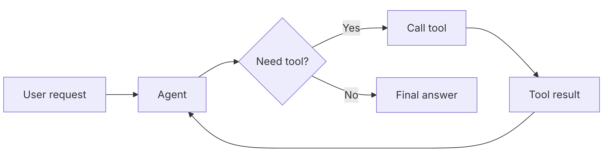
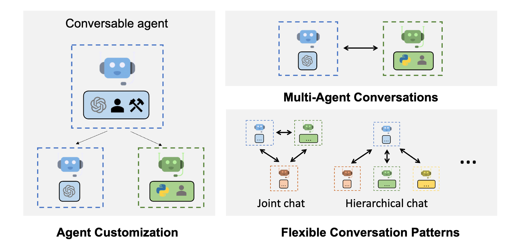

# Related work

Since Model Context Protocol (MCP) was recently introduced in November of 2024 [@model-context-protocol], there has been limited research focused on its security implications. This gap presents a valuable opportunity for new research and innovation in MCP security. Most current security approaches for MCP are still in early development, leaving vulnerabilities that could be exploited by attackers. As MCP adoption grows rapidly across organizations, the need for robust security measures becomes increasingly critical. Additionally, understanding the current landscape of MCP security tools and their limitations provides important context for how Vurze addresses unmet needs in the ecosystem.

## Rise of Agentic AI

Since large language models (LLMs) like OpenAI's ChatGPT became widely available in November 2022 [@walsh2025chatgpt], there has been rapid progress toward more autonomous AI systems. Early versions of many LLMs demonstrated impressive natural language understanding and generation capabilities, but they were primarily limited to responding to user prompts. This limitation spurred significant research aimed at transforming these powerful language models into agentic systems capable of reasoning about complex problems and taking autonomous actions to achieve specific goals.

Agentic AI refers to AI systems designed to act autonomously, going beyond the reactive nature of traditional LLMs by independently planning and executing multi-step tasks [@agentic-ai-review-2025]. Unlike standard LLMs that simply generate text responses, agentic AI systems can interact with external tools, maintain persistent goals, and adapt their strategies based on environmental feedback. The goal of agentic AI systems is to mimic human decision-making behavior. However, one of the largest problems with agentic AI is the lack of a standardized and universally accepted definition. There are questions as to what behavior is considered agentic in the first place. Despite this definitional ambiguity, the core characteristics of autonomy, goal-orientation, and interaction with external systems distinguish agentic AI from traditional LLMs.

While much of the research surrounding agentic AI is currently underway, understanding its evolution provides important context. The Agentic AI field emerged from foundational work in reinforcement learning, where systems learn through trial and error by receiving rewards for successful actions. It also built upon neural networks, which are computational models inspired by the human brain's structure [@agentic-ai-review-2025]. From these building blocks, more complex LLMs like GPT-3.5 were created that demonstrated the ability to reason and generate human-like responses across many tasks. Currently there are many systems that utilize LLM's to create more specialized AI agents.

### LangChain

LangChain, introduced in late 2022, is one of the most prominent frameworks for building agentic AI applications. The framework provides developers with a comprehensive toolkit for creating AI agents and applications powered by LLMs from providers like OpenAI, Anthropic, and Google [@langchain-quickstart]. LangChain allows developers to define system prompts, create tools, select different LLMs, specify response formats, and add memory capabilities to their agents.

LangChain has also been widely adopted for many applications with the package receiving millions of downloads monthly from the Python Package Index (PyPI) [@langchain]. Despite its popularity, LangChain faces several documented limitations. The framework's complexity creates a steep learning curve for new developers, particularly when customizing agent behavior. Additionally, concerns have been raised about the transparency of agent decision-making processes and the difficulty in ensuring predictable behavior in production environments. While the framework provides many layers of abstraction, these same layers can sometimes obscure underlying operations and make it challenging to optimize performance or troubleshoot failures in complex agent workflows.

Similar to MCP, which uses Python decorators to define tools in a standardized format, LangChain also relies on a `@tool` decorator pattern [@langchain-quickstart]. While these two systems may appear nearly identical on the surface, they differ fundamentally in their architectural approaches. One key distinction is that MCP establishes a client-server protocol with clear boundaries between the host application and tool providers. In contrast, LangChain integrates tools more tightly within the agent's execution environment, allowing functions to directly access runtime context and agent memory without the intermediary protocol layer that MCP provides.

[@langchain-quickstart]

### AutoGen

AutoGen, introduced by Microsoft Research in 2023, represents another significant advancement in building multi-agent conversational systems [@autogen-2023]. Unlike both MCP and LangChain's focus on providing a general-purpose framework for LLM applications, AutoGen specifically emphasizes multi-agent collaboration where multiple AI agents work together to solve complex tasks. The Autogen framework enables developers to create agents that can autonomously communicate with each other, execute code, use tools, and iteratively refine solutions through dialogue. Overall, Autogen expands beyond MCP and LangChain to explore how agents can communicate with each other.

AutoGen achieves multi-agent collaboration through a conversational pattern where agents are assigned distinct roles and capabilities. Developers can configure agents with specific responsibilities and then allow them to communicate autonomously through structured dialogues. For instance, a research assistant application might deploy a PlannerAgent to break down complex queries into subtasks, a ResearcherAgent to gather information from various sources, and a SummarizerAgent to synthesize findings into coherent reports. Once these agents are defined, they can engage in a conversation and request information from each other.

The fundamental difference between AutoGen and MCP lies in their scope. MCP is a protocol designed to standardize how AI applications connect to external tools and data sources through a client–server architecture. It defines the communication layer between a host application (such as Claude Desktop) and tool servers. In contrast, AutoGen is an application framework for orchestrating conversations between multiple AI agents within a single application environment. It does this by defining agent classes with specific roles, conversation patterns, and code execution capabilities, then managing the message flow between these agents according to predefined rules [@autogen-2023].

[@autogen-2023]

## Creation of MCP  

### Rapid Adoption and Impact

after being intially released in late 2024, model context protocl (mcp). quickly became popoular.[@model-context-protocol] the model context protcol The popularity of Model Context Protocol (MCP) has surged since its release, as evidenced by the rapid growth of the official GitHub MCP registry [@github-mcp-registry]

what sort of impact has mcp had???

### Need for Standardization

many ai tools that work on top of llms. but no standardization
Development and release of agentic ai → anthropic responds with mcp
Explores the origins, growth, and current state of MCP, including its adoption by major organizations.

### Technical Innovation of MCP

x
in depth diagram here
diagram here?

## Fast MCP

talk about what fast mcp is. and what it allows you to do. 
diagram here?

### Security Limitations

easy to implement but dont offer additional security features. talk about the shortcomings of fast mcp

## MCP Scan Security Tooling  

summary of mcp scan and how it detects attacks. talk about popularity of tool. also talk about its shortcomings.
History of Contextual Security???
(credit card fraud ai) (ai for security) uses things that look like what might be fraudulent. but how do we know for sure?
