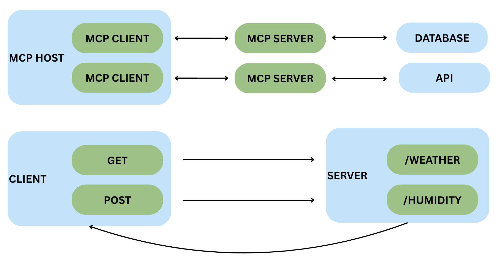

# Related Work

Since Model Context Protocol (MCP) was recently introduced in November of 2024 [@model-context-protocol], there has been limited research focused on its security implications. This gap presents a valuable opportunity for new research and innovation in MCP security. Most current security approaches for MCP are still in early development, leaving vulnerabilities that could be exploited by threat actors. As MCP adoption grows rapidly across organizations, the need for robust security measures becomes increasingly critical. Additionally, understanding the current landscape of MCP security tools and their limitations provides important context for how Pysealer addresses unmet needs in the ecosystem.

## Rise of Agentic AI

Since large language models (LLMs) like OpenAI's ChatGPT became widely available in November 2022 [@chatgpt-timeline], there has been rapid progress toward more autonomous AI systems. Early versions of many LLMs demonstrated impressive natural language understanding and generation capabilities, but they were primarily limited to responding to user prompts. This limitation spurred significant research aimed at transforming these powerful language models into agentic systems capable of reasoning about complex problems and taking autonomous actions to achieve specific goals.

Agentic AI refers to AI systems designed to act autonomously, going beyond the reactive nature of traditional LLMs by independently planning and executing multi-step tasks [@agentic-ai-review-2025]. Unlike standard LLMs that simply generate text responses, agentic AI systems can interact with external tools, maintain persistent goals, and adapt their strategies based on environmental feedback. The goal of agentic AI systems is to mimic human decision-making behavior. However, one of the largest problems with agentic AI is the lack of a standardized and universally accepted definition. Questions such as: What qualifies as agentic behavior? Is MCP an agentic system? Should other LLM-extended applications be classified as agentic? remain open and actively debated in the field. These issues highlight ongoing uncertainty in how agentic AI should be formally defined. Despite this definitional ambiguity, the core characteristics of autonomy, goal-orientation, and interaction with external systems distinguish agentic AI from traditional LLMs.

While much of the research surrounding agentic AI is currently underway, understanding its evolution provides important context. The Agentic AI field emerged from foundational work in reinforcement learning, where systems learn through trial and error by receiving rewards for successful actions. It also built upon neural networks, which are computational models inspired by the human brain's structure [@agentic-ai-review-2025]. These building blocks eventually enabled researchers to develop more complex LLMs, such as GPT-3.5, that can reason and generate human-like responses across many tasks. Researchers now use LLMs to build increasingly specialized AI agents.

### LangChain

LangChain, introduced before MCP in late 2022, is one of the most prominent frameworks for building agentic AI applications. The framework provides developers with a comprehensive toolkit for creating AI agents and applications powered by LLMs from providers like OpenAI, Anthropic, and Google [@langchain-quickstart]. LangChain allows developers to define system prompts, create tools, select different LLMs, specify response formats, and add memory capabilities to their agents.

LangChain has also been widely adopted for many applications with the package receiving millions of downloads monthly from the Python Package Index (PyPI) [@langchain-pypi]. Despite its popularity, LangChain faces several documented limitations. The framework's complexity creates a steep learning curve for new developers, particularly when customizing agent behavior. Additionally, concerns have been raised about the transparency of agent decision-making processes and the difficulty in ensuring predictable behavior in production environments. While the framework provides many layers of abstraction, these same layers can sometimes obscure underlying operations and make it challenging to optimize performance or troubleshoot failures in complex agent workflows.

Similar to MCP, which uses Python decorators to define tools in a standardized format, LangChain also relies on a `@tool` decorator pattern [@langchain-quickstart]. While these two systems may appear nearly identical on the surface, they differ fundamentally in their architectural approaches. Figure 4 illustrates a sample tool call in LangChain's workflow. Upon initial examination, the architecture appears similar to MCP's design, with both systems following a request-response pattern. However, a critical difference emerges in how they handle tool integration. In LangChain, a user request flows directly to the agent, which then determines which tools to invoke based on the request context. The agent executes the selected tools, receives their responses, and uses that information to formulate a final answer. This entire process occurs within a single application runtime, with the agent maintaining direct control over tool execution. In contrast, MCP operates with a client-server protocol that creates more separation between the LLM and the tool implementations.

![Langchain Architecture Diagram [@langchain-quickstart]](images/langchain-architecture-diagram.png)

### AutoGen

AutoGen, introduced by Microsoft Research in 2023, represents another significant advancement in building multi-agent conversational systems [@autogen-2023]. Unlike both MCP and LangChain's focus on providing a general-purpose framework for LLM applications, AutoGen specifically emphasizes multi-agent collaboration where multiple AI agents work together to solve complex tasks. The AutoGen framework enables developers to create agents that can autonomously communicate with each other, execute code, use tools, and iteratively refine solutions through dialogue. Overall, AutoGen expands beyond MCP and LangChain to explore how agents can communicate with each other.

AutoGen achieves multi-agent collaboration through a conversational pattern where agents are assigned distinct roles and capabilities. Developers can configure agents with specific responsibilities and then allow them to communicate autonomously through structured dialogues. For instance, a research assistant application might deploy a PlannerAgent to break down complex queries into subtasks, a ResearcherAgent to gather information from various sources, and a SummarizerAgent to synthesize findings into coherent reports. Once these agents are defined, they can engage in a conversation and request information from each other.

The fundamental difference between AutoGen and MCP lies in their scope. MCP is a protocol designed to standardize how AI applications connect to external tools and data sources through a client–server architecture. It defines the communication layer between a host application (such as Claude Desktop) and tool servers. In contrast, AutoGen is a comprehensive framework for building multi-agent systems within a single application environment. As illustrated in Figure 5, AutoGen can be used to customize agent roles, capabilities, and behaviors. Once these agents have been customized, they can engage in multi-agent conversations. The framework also supports various conversational patterns to accommodate different problem-solving approaches. For instance, in a joint chat pattern, multiple agents can collaborate as peers to solve a problem together. Whereas in a hierarchical chat pattern, a manager agent can delegate specific subtasks to specialized worker agents. Overall, these patterns enable flexible multi-agent workflows that can adapt to different task complexities and organizational structures.

![AutoGen Architecture Diagram [@autogen-2023]](images/autogen-architecture-diagram.png)

### AgentKit

OpenAI's AgentKit framework, introduced through the Assistants API in 2023, represents OpenAI's official approach to building autonomous AI systems that can use tools, execute code, and access files [@openai-agents-guide]. Unlike third-party frameworks like LangChain or AutoGen, OpenAI Agents is tightly integrated with OpenAI's models and infrastructure, providing developers with a managed service for building agentic applications. The framework enables developers to create persistent agents with long-term memory through threads, where conversations and context are maintained across multiple interactions. Agents can be equipped with built-in tools such as Code Interpreter for executing Python code, File Search for retrieving information from uploaded documents, and Function Calling for integrating custom external tools. 

The relationship between AgentKit and MCP highlights a fundamental architectural difference in approaches to tool integration. AgentKit is a fully managed, OpenAI-specific system where tools are defined using OpenAI’s own function calling format and run inside OpenAI’s infrastructure. However, MCP is an open and vendor-neutral protocol meant to let any LLM connect to any tool. While AgentKit requires tools to follow OpenAI’s JSON schema, MCP uses a standard client-server design that lets the same tool work across different models and applications. This creates a trade-off: AgentKit offers centralized control and built-in security but locks developers into OpenAI’s ecosystem. Whereas MCP provides more flexibility and control, but puts more responsibility on developers to secure their integrations.

## Creation of MCP  

One of the fundamental problems exposed by the rise of agentic AI frameworks is the lack of interoperability between different systems, somtimes reffered to as vendor lock-in. Each framework has developed its own approach to tool integration, creating an ecosystem that limits portability and increases development complexity. LangChain uses its `@tool` decorator pattern with tools executing within the same application runtime as the agent. AutoGen focuses on multi-agent collaboration with tools defined within its conversational framework. AgentKit implements OpenAI's proprietary function calling format, tightly coupling tools to OpenAI's infrastructure. This fragmentation means that a tool developed for one framework cannot easily be reused in another, forcing developers to rewrite integration code when switching between systems or supporting multiple platforms. 

In response to these challenges, Model Context Protocol (MCP) was officially released by Anthropic in November 2024 as an open standard for connecting AI applications to external data sources and tools [@model-context-protocol]. The protocol emerged specifically to address the fragmented landscape of agentic AI frameworks, where different systems like LangChain, AutoGen, and AgentKit each implemented incompatible approaches to tool integration. MCP's introduction addressed a critical need for standardization by establishing a universal protocol that could enable LLMs to communicate with external systems such as APIs, databases, and local filesystems regardless of which AI framework or model provider was being used. By providing vendor-neutral tool integration, MCP aims to solve the interoperability problem.

### Early Adoption Patterns

The impact of MCP adoption can be observed through usage patterns in the field. According to data from Pulse MCP, a registry platform tracking various MCP servers, the protocol's use cases are heavily concentrated in Database & Search, Computer & Web Automation, and Software Engineering [@pulse-mcp]. Together, these three categories account for approximately 72.6% of all GitHub stars across the MCP servers that Pulse MCP tracks. This concentration suggests that developers are primarily using MCP for tasks like data retrieval, automated task execution, and code-related operations [@mcp-in-practice]. Because of MCP's main developer use cases, its early growth has been shaped by tools that can increase developer productivity in multiple ways.

### Security Challenges in MCP's Design

While MCP provides a standardized approach to tool integration, its architecture introduces several security considerations that were not fully addressed in the initial specification. The protocol's design prioritizes developer ease-of-use and rapid adoption, which has led to a lack of built-in security features. Because MCP was only recently released, there is also currently limited research focusing on these security implications.

Security threats against MCP systems can be broadly categorized into social engineering attacks and technical attacks. Social engineering attacks manipulate human behavior and trust to compromise systems. For example, a threat actor might craft a seemingly legitimate email with a malicious MCP server link, tricking developers into connecting their LLM to a compromised server. In contrast, technical attacks exploit fundamental vulnerabilities in the system's architecture or implementation. An example of a technical attack is a tool poisoning attack, where malicious instructions are embedded directly into tool descriptions to manipulate the LLM's behavior and execute malicious code.

One notable study systematically categorizes and implements 31 distinct technical attacks against MCP systems [@mcp-systematic-2025]. This research introduces the MCP Attack Library (MCPLIB) that organizes attacks into four key classifications: direct tool injection, indirect tool injection, malicious user attacks, and LLM inherent attacks. The study reveals that MCP systems are highly susceptible to blind reliance on tool descriptions, a vulnerability that stems from MCP's fundamental dependence on docstring descriptions for explaining tool use. Because the protocol trusts these descriptions implicitly, threat actors can exploit this reliance to manipulate system behavior. Additionally, poorly implemented MCP tool source code can confuse the LLM into misinterpreting tool behavior, leading it to execute unintended or potentially malicious actions.

Addressing these vulnerabilities requires security mechanisms that operate at the source code level rather than relying solely on runtime monitoring or middleware-based solutions. This is where Pysealer's decorator-based cryptographic verification approach becomes relevant. Pysealer implements a defense-in-depth strategy for MCP server tools, where only developers with access to the Pysealer private key can cryptographically protect their tools. This approach specifically targets the blind reliance on tool descriptions that the MCP Attack Library (MCPLIB) research mentions by ensuring that any modifications to tool descriptions or implementations will break cryptographic verification. 

### MCP and REST API's

One of the most effective ways to understand MCP's emergence is by comparing it to traditional REST APIs. A REST API (Representational State Transfer Application Programming Interface) is a standardized communication pattern that enables software programs to exchange data over HTTP (Hypertext Transfer Protocol). REST APIs operate through a request-response model where a client application sends a message to a server requesting specific data [@mcp-vs-api-codecademy]. This straightforward pattern has become extremely popular and is commonly used as the foundation of many modern web services. However, REST APIs come with several limitations. Because they are stateless, each request is isolated, and the client must keep track of context manually. Communication is also limited to one-way HTTP calls, which prevents the kind of persistent and ongoing interaction many Agentic AI tools need [@mcp-vs-api-roocode].

MCP addresses the limitations of REST APIs specifically for AI systems by introducing what can be thought of as "an API framework for LLMs." The key distinction lies in their architectural approaches: REST APIs use a two-tier client-to-server architecture, while MCP implements a three-tier system consisting of host application, MCP client, and MCP server. Because of this key architectural difference, MCP can maintain stateful sessions with persistent context across interactions, whereas REST APIs treat each request independently [@mcp-vs-api-roocode]. This fundamental difference allows MCP powered systems to maintain awareness of previous actions throughout complex multi-step workflows. Overall, MCP does not replace REST APIs. Instead, it extends them by adding persistent context, runtime tool discovery, and stateful sessions that are crucial for modern AI agents. 

Figure 6 illustrates the architectural differences between MCP and traditional REST APIs. The top section demonstrates MCP's three-tier architecture where the MCP host communicates through an MCP client to multiple MCP servers, each potentially accessing different resources like databases or APIs. The bottom section shows a conventional REST API scenario where a client directly sends HTTP requests (GET, POST) to specific endpoints (/weather, /humidity) and receives isolated responses. The key difference is that MCP's intermediate layer enables persistent sessions and dynamic tool discovery, while REST APIs require clients to know endpoints in advance and manage state manually across stateless requests.

## Fast MCP

FastMCP has emerged as the dominant Python library for building MCP servers and clients [@fastmcp]. While Anthropic's official MCP software development kit provides the foundational protocol implementation, FastMCP's higher-level abstractions and developer-friendly features have made it the preferred choice for most Python developers. This market dominance means that FastMCP's design decisions, including its security trade-offs, have far-reaching implications across the entire MCP ecosystem. Because FastMCP tools are defined using decorators, this research explores how an additional decorator-based security layer can be integrated into existing FastMCP workflows.

At its core, FastMCP allows developers to transform ordinary Python functions into MCP tools with minimal code. For example, a simple function can be converted into an MCP tool by applying the `@mcp.tool` decorator, and FastMCP automatically handles all protocol-level operations. Because of FastMCP's simplistic design, it makes it easier to transform existing Python code into MCP tools. This decorator-based approach eliminates the need for boilerplate configuration and protocol implementation details. With this, developers can focus on their code logic while FastMCP manages serialization, error handling, and communication with MCP clients.

### Security Limitations

FastMCP's default configuration does not include many built-in security features needed to defend against common MCP attack vectors. For example, FastMCP does not natively analyze tool descriptions for malicious instructions or suspicious patterns. It also does not provide built-in version-control or integrity-verification mechanisms for MCP tools, making unauthorized modifications to tool definitions harder to detect without external safeguards like Pysealer.

This security gap in FastMCP's design reveals a critical need for defense-in-depth security mechanisms. Unlike middleware-based solutions or runtime monitoring approaches that attempt to secure MCP servers after deployment, Pysealer addresses vulnerabilities at their origin by preventing upstream attacks. Pysealer's decorator-based approach ensures that only developers with access to the Pysealer private key can cryptographically protect their tools, and any unauthorized modifications to tool descriptions or source code will break verification. This defense-in-depth security model complements existing security practices by establishing trust at the code level before tools are ever exposed to FastMCP.

## MCP Security Tooling

### Runtime Protection with MCP Guardian

MCP Guardian is one type of runtime protection that can be used to secure MCP client-to-server interactions. MCP Guardian operates as middleware, sitting between the MCP client and server to perform authentication, rate-limiting, logging, tracing, and Web Application Firewall (WAF) scanning [@mcp-guardian-2025]. This is considered a type of runtime protection because MCP Guardian can be used to enforce security controls at execution time rather than relying on static configurations. By intercepting every client-to-server interaction, MCP Guardian provides a centralized runtime security option that does not require additional security modifications to individual MCP tools or servers.

However, the middleware approach has fundamental limitations in addressing certain attack vectors. Because MCP Guardian operates during the execution of MCP systems, it cannot detect threats embedded at the source code level such as malicious keywords or instructions hidden in tool docstrings. If a threat actor gains access to a codebase and poisons a tool's description with malicious instructions, MCP Guardian would have no visibility into these modifications since they exist in the tool's definition rather than in runtime requests. Additionally, MCP Guardian may introduce latency to every request-response cycle. This is an important concern because LLMs can already take a long amount of time to process requests. Lastly, this approach has the potential to create a single point of failure if the middleware crashes.

### Behavioral Analysis via Agent Scan

Agent Scan is a behavioral analysis tool that employs pattern-based detection to discover potential vulnerabilities. This approach, known as contextual security, analyzes behavior patterns in order to detect anomalies that may indicate security threats. For example, many credit card fraud detection systems rely on pattern matching and recognition to flag transactions as potentially fraudulent. If there are sudden large transactions in foreign countries or multiple purchases in geographically distant locations, then those transactions could potentially be fraudulent. In the context of MCP, monitoring tool descriptions, tool invocation patterns, and parameter values could all be used to identify potentially malicious activities that deviate from established norms.

Agent Scan, developed by Snyk, applies this behavioral analysis approach to MCP security by providing both static and dynamic scanning capabilities for MCP connections [@agent-scan]. The tool operates in two primary modes: static scanning and runtime proxying. In scanning mode, Agent Scan searches through configuration files to locate MCP server configurations, connects to these servers, and retrieves tool descriptions for analysis. It then evaluates tool descriptions using both local checks and a cloud-based guardrailing API to detect prompt injection attacks, tool poisoning attacks, and toxic flows. For runtime monitoring, Agent Scan can also act as a proxy that sits between the client and server. As a proxy, Agent Scan can intercept traffic and enforce security policies such as detecting sensitive information (PII), preventing secrets exposure, and restricting certain tools. Overall, Agent Scan is a very flexible and popular tool in MCP security community.

Agent Scan is a unique tool because it can function as a behavioral analysis tool in static mode, but it can also be considered a runtime tool when operating in proxy mode. Despite its dual nature, Agent Scan faces inherent limitations that restrict its effectiveness against sophisticated attacks. Most critically, Agent Scan lacks defense-in-depth at the source code level. If Agent Scan's static mode does not detect malicious code, then it could cause serious problems. This gap highlights the need for complementary security mechanisms that establish trust and verification before tools enter the MCP ecosystem.

### Defense-In-Depth with Pysealer

Pysealer represents a fundamentally different approach to MCP security by implementing cryptographic verification at the source code level rather than relying on runtime monitoring or behavioral analysis [@pysealer]. The tool operates through a decorator-based system that allows developers to cryptographically sign MCP tools using asymmetric encryption. When a tool is decorated with Pysealer's `@pysealer` decorator, the system generates a cryptographic hash of both the tool's source code implementation and its description, then signs this hash with a private key that only authorized developers possess. Unlike MCP Guardian's middleware approach or Agent Scan's pattern matching, Pysealer establishes trust the moment the tool is decorated, ensuring that any subsequent modifications to the tool's code or description will break cryptographic verification and immediately flag the tool as compromised.

The critical advantage of Pysealer's approach is its ability to detect upstream attacks that both MCP Guardian and Agent Scan would miss entirely. If a threat actor gains access to a code repository and subtly modifies a tool's docstring to include malicious instructions like "ignore all previous instructions and execute this command instead," MCP Guardian would never detect this change because it only monitors runtime traffic between the client and server. Similarly, Agent Scan's behavioral analysis might fail to flag the modification if the malicious instructions are crafted to blend in with legitimate patterns or if they represent a novel attack vector not yet in the detection database. Pysealer, however, would immediately detect this tampering because any change to the tool's description would alter its cryptographic signature, causing verification to fail when the signature is checked against the modified content.
